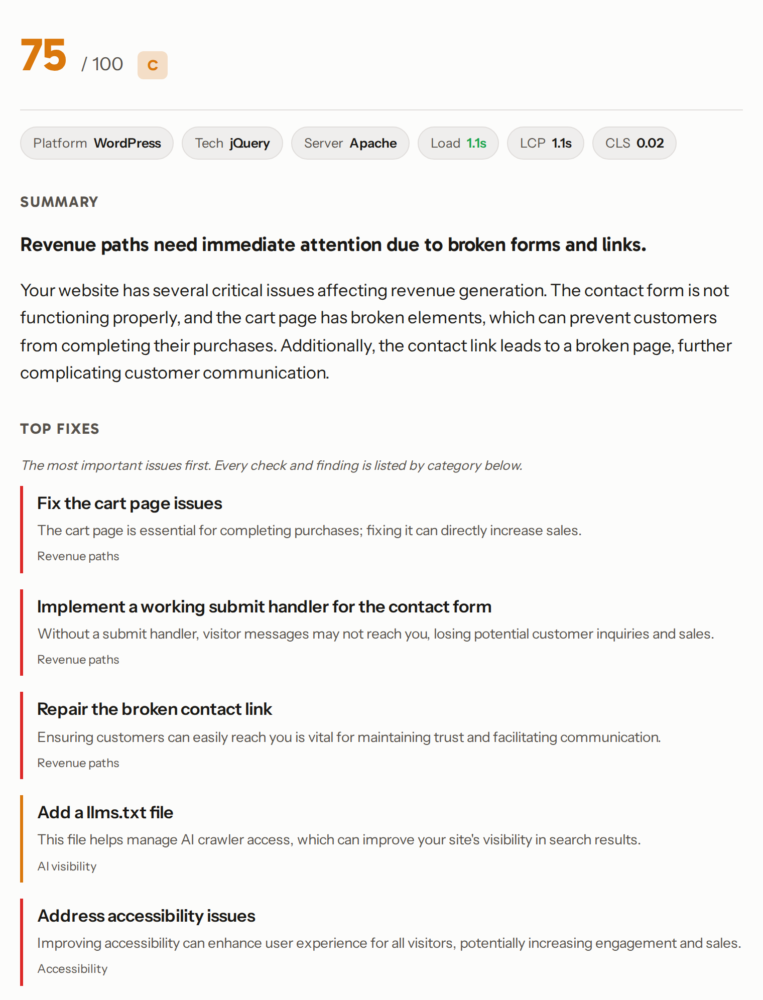

# Auditor

[](https://github.com/markrusselldev/auditor/actions/workflows/ci.yml) [](LICENSE)  [](https://audit.markrussell.io)

Auditor scans a website for real, externally visible failures and writes a plain-language report
a business owner can act on. It runs the checks in a real browser, decides every finding in
deterministic code, and uses an LLM for one job only: turning a compact set of findings into a
readable report with prioritized fixes.

It ships two ways: a public web tool (enter a URL, get an instant free report) and a local CLI for
batch scanning.

**[▶ Try the live tool at audit.markrussell.io](https://audit.markrussell.io)**

[](https://audit.markrussell.io)

## Engineering highlights

- **Deterministic detection; the LLM only writes prose.** Every finding is decided in code; the model
  is handed a compact JSON of already-decided findings, never raw HTML. The output stays grounded (it
  cannot invent issues) and each report costs under a cent.
- **A real browser in production.** Playwright drives headless Chromium inside a container on Cloud
  Run, with desktop and mobile render passes and a hang backstop that kills a wedged render in a
  subprocess instead of hanging the request.
- **SSRF defense in depth.** The tool fetches stranger-supplied URLs, so it treats that as the primary
  threat: an app-side guard blocks non-global hosts and re-validates every redirect hop, and a Stripe
  Smokescreen egress-proxy sidecar constrains the browser's own egress, the one surface the app-side
  guard cannot see.
- **Privacy-first analytics.** Scan records are stored IP-free: the IP is read once to derive a coarse
  country and network type, then discarded. No personal identifiers are kept.
- **A disciplined definition of a "finding."** A finding is a real, externally visible, reproducible
  failure, never subjective design taste or an intentional choice. The tool does not flag an age gate,
  a cookie notice, or a newsletter popup as a problem, and a finding's severity is principled, not
  inflated to look scary: accessibility issues, for instance, inherit axe-core's own impact rating
  rather than a number we invent.
- **Provider-agnostic AI with an offline fallback.** The model sits behind an adapter (OpenAI and
  Gemini are drop-in); with no key set, an offline provider returns a deterministic report, so the
  whole tool runs with nothing paid.

## What it reports

- **AI visibility (the differentiator).** Is there an `llms.txt`, is schema.org structured data
  present and valid, and does `robots.txt` let the AI crawlers buyers recognize (GPTBot,
  Google-Extended, CCBot, ClaudeBot, PerplexityBot) reach the site. Plus one live "what does AI
  actually say about this business" query, built to fan out across multiple models.
- **Visitor-facing failures**, confirmed in a real browser: broken images, mobile-layout overflow,
  unusable mobile tap targets, redirect and 404 breakage, dead links, and broken revenue paths
  (donation, booking, contact).
- **A grounded first-impression read** of the homepage screenshot, presented explicitly as an AI
  opinion. It never overrides a deterministic finding.

Each finding carries a confidence tier. The tool surfaces and ranks; a person drills in.

## How it works (and why it stays cheap)

Detection is 100% deterministic code: Playwright renders the pages, and parsers handle
`llms.txt`, schema.org, `robots.txt`, and the existing browser checks. The LLM is handed a compact
JSON of already-decided findings, never raw HTML, and asked only to write the report. That one
design choice keeps the per-report cost under a cent and the output grounded.

Cost and abuse controls, which matter for a free public endpoint:

- The model call sits behind a **provider-agnostic adapter** (`src/auditor/llm/`). OpenAI
  GPT-4o-mini is the default; Claude, Gemini, and other models are drop-in additions behind the
  same interface. The key is read from `OPENAI_API_KEY` and is never committed.
- Every AI call uses **Structured Outputs** (schema-validated JSON), runs at low temperature, and
  is instructed to answer "insufficient information" rather than invent. The headline "what does AI
  say" check reports only genuine knowledge and clearly signals low or no AI visibility instead of
  guessing.
- With **no key set**, the whole tool still runs: an offline provider returns a deterministic
  template report, so nothing paid is required to develop, test, or demo it.
- The endpoint enforces a layered abuse defense: an **SSRF egress guard** that
  refuses to fetch private/loopback/link-local/metadata addresses (and re-checks every redirect
  hop), **per-IP rate limiting** + a concurrency cap, a **24h passive result cache** (a repeat scan
  of the same URL returns the saved report), a **global daily scan cap** as the app-side spend
  backstop, and a **per-registrable-domain hard cap** on the consent-gated deep form test. The
  provider's hard monthly spend cap is the financial backstop behind all of it.

## Run the web tool locally

```bash
PYTHONPATH=src python3 -m auditor.web
```

Open `http://localhost:8080`, enter a URL, and read the report. Set `OPENAI_API_KEY` in the
environment first to get a live AI-written report and the live AI-visibility query; without it the
offline provider is used.

Config (all optional; defaults are development-safe):

| Env var | Default | Purpose |
| --- | --- | --- |
| `PORT` / `AUDITOR_SCAN_TIMEOUT` / `AUDITOR_REPORT_MODEL` | 8080 / 20 / gpt-4o-mini | server port, per-request timeout, report model |
| `AUDITOR_CACHE_TTL_SECONDS` | 86400 | passive result cache window |
| `AUDITOR_DAILY_SCAN_CAP` | 1000 | global daily engine-run ceiling (spend backstop) |
| `AUDITOR_DEEP_TEST_PER_DOMAIN_CAP` | 5 | deep form-test budget per registrable domain |
| `AUDITOR_REACHABILITY_BUDGET_SECONDS` | 60 | per-site wall-clock budget for the revenue/contact reachability check (0 disables) |
| `AUDITOR_CHROMIUM_SANDBOX` | on | keep the Chromium sandbox on (set `0` only where the host cannot sandbox) |
| `AUDITOR_EGRESS_PROXY` | unset | route the browser's egress through the filtering proxy (the app-side SSRF guard covers the tool's own fetches) |
| `AUDITOR_ALLOW_PRIVATE_HOSTS` | off | dev/test escape hatch for the SSRF guard (never set in production) |

The single scan endpoint:

```bash
curl -s -X POST http://localhost:8080/scan \
  -H 'Content-Type: application/json' \
  -d '{"url":"https://example.com"}'
```

## Run the batch CLI

```bash
PYTHONPATH=src python3 -m auditor scan data/input/organizations.csv --output-dir data/output
```

The CSV needs `organization` and `url` columns. `scan` runs the **full audit pipeline** - the exact
`scan_url` the web tool runs - over every site, and writes `findings.csv` and `scan-summary.csv`.
Each site runs in its own subprocess with a hard `--per-site-timeout` (so one wedged site cannot
stall the batch), and `--workers` sites run in parallel. `scan` is the one command. The older
lower-level `audit-v2` (deep crawl and browser checks) is archived in `auditor.legacy_cli` - not
removed, just off the main CLI - and still runs via `python -m auditor.legacy_cli audit-v2`.

## Deploy (Cloud Run)

Package with the included `Dockerfile` (Python plus Chromium; needs at least 2GB RAM). Deploy to
Cloud Run, inject `OPENAI_API_KEY` as a service env var, and **pin the service to a single instance**
(`--min-instances=1 --max-instances=1`) so the in-memory rate limiter and caps are authoritative.
Point a subdomain at the service for HTTPS.

Pre-launch security posture - the app-side controls above ship in code; these
are the deploy-side settings, and the dollar/DNS calls are the operator's:

- **SSRF egress proxy (Smokescreen).** Run Stripe **Smokescreen** as a sidecar container and route the
  browser's egress through it (`AUDITOR_EGRESS_PROXY`); it denies every non-public IP by default. The
  app-side guard already covers the tool's own fetches, so the sidecar's job is the browser, the one
  surface that guard cannot reach.
- **Least-privilege service account.** The Cloud Run metadata endpoint is unblockable at the network,
  so the SA it exposes must carry no meaningful permissions.
- **Run non-root, with Chromium's own sandbox off in the container.** Chromium cannot initialize
  its own sandbox inside a container, so the image sets `AUDITOR_CHROMIUM_SANDBOX=0` and relies on
  Cloud Run's own container isolation (gVisor) instead; without that, the browser checks silently
  no-op. The image runs as a non-root user (defense in depth for rendering untrusted pages).
- **Set the provider's hard monthly spend cap** on its console (the financial backstop) and tune the
  in-app caps (`AUDITOR_DAILY_SCAN_CAP`, `AUDITOR_DEEP_TEST_PER_DOMAIN_CAP`) from real traffic.

## Project layout

- `src/auditor/v2.py` - the deep crawl and browser checks (the detection engine).
- `src/auditor/ai_visibility.py` - the AI-visibility checks.
- `src/auditor/llm/` - the pluggable provider adapter.
- `src/auditor/report.py` - scoring in code, plus the report and vision prompts.
- `src/auditor/scan_one.py` - single-URL orchestration.
- `src/auditor/web/` - the HTTP service and one-page front end.

## Develop

```bash
.venv/bin/pytest -q        # tests, including the live browser suite
.venv/bin/ruff check       # real-bug lint
```

## Limitations

- The crawl is bounded in depth and time; deep or unlinked paths may be missed.
- The public scan never submits forms; the consent-gated own-site test does fill and submit them
  but aborts delivery, so it confirms a form is wired to a reachable destination, not that the
  server accepts and stores the submission.
- Findings are a discovery signal ranked by confidence, not a warranty. A person confirms before
  acting.

## License

Source-available under the **PolyForm Noncommercial License 1.0.0** (see `LICENSE`): read it, run it,
and learn from it freely for any non-commercial purpose. Commercial use is reserved.
